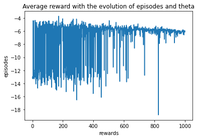

## Neural Network Policy Gradient Optinal Control

Optimal control of Pendulum in Gym Environment. Run the following script. 

```
python3 damped_pendulum.py
```

Dependencies : 
1. Gym Environment
2. Numpy
3. OS

The following are the results of the rewards and theta



